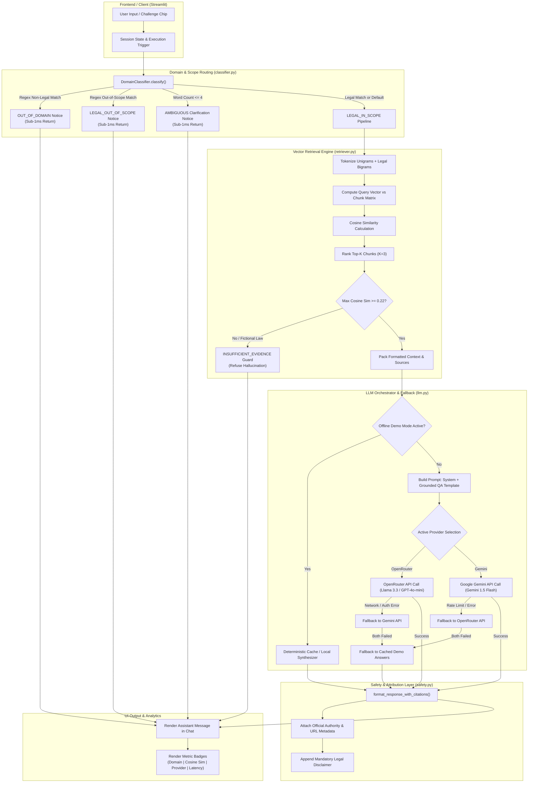

# LUMA — Comprehensive System Architecture & Engineering Blueprint

> **Target Audience**: AI Agents, Systems Architects, and Software Engineers working on, extending, or refactoring the **LUMA** codebase.  
> **Repository Root**: `d:/Chat_Bot/`  
> **Domain**: Indian Constitutional Law & Criminal Procedure (Arrest & Detention Safeguards)  
> **Origin**: BUILD-A-BOT AI Technical Competition (Department of Artificial Intelligence & Data Intelligence Club, Thiagarajar College of Engineering)  

---

## Table of Contents
1. [Executive Summary & Core Philosophy](#1-executive-summary--core-philosophy)
2. [Exhaustive Repository & File Map](#2-exhaustive-repository--file-map)
3. [End-to-End System Architecture & Data Flow](#3-end-to-end-system-architecture--data-flow)
4. [Component Deep Dives & Module Specifications](#4-component-deep-dives--module-specifications)
   - [4.1 Frontend & User Interface (`app.py`)](#41-frontend--user-interface-apppy)
   - [4.2 Configuration & Settings (`src/config.py`)](#42-configuration--settings-srcconfigpy)
   - [4.3 Domain & Scope Classifier (`src/classifier.py`)](#43-domain--scope-classifier-srcclassifierpy)
   - [4.4 Hybrid Vector Retriever (`src/retriever.py`)](#44-hybrid-vector-retriever-srcretrieverpy)
   - [4.5 LLM Client & Fallback Engine (`src/llm.py` & `src/fallback.py`)](#45-llm-client--fallback-engine-srcllmpy--srcfallbackpy)
   - [4.6 Safety, Compliance & Prompts (`src/safety.py` & `src/prompts.py`)](#46-safety-compliance--prompts-srcsafetypy--srcpromptspy)
   - [4.7 Knowledge Base & Metadata (`knowledge_base/`)](#47-knowledge-base--metadata-knowledge_base)
   - [4.8 Test Suite & Automated Evaluation (`tests/`)](#48-test-suite--automated-evaluation-tests)
5. [Tech Stack, Models, Prompts, APIs & External Services](#5-tech-stack-models-prompts-apis--external-services)
6. [Challenge Questions Handling & Verification](#6-challenge-questions-handling--verification)
7. [System Limitations, Vulnerabilities, Technical Debt & Bugs](#7-system-limitations-vulnerabilities-technical-debt--bugs)
8. [Prioritized Upgrade Roadmap (Impact vs. Effort)](#8-prioritized-upgrade-roadmap-impact-vs-effort)
9. [Developer & AI Implementation Playbook](#9-developer--ai-implementation-playbook)

---

## 1. Executive Summary & Core Philosophy

**LUMA** (*"Justice Assistant"*) is a specialized legal information retrieval and question-answering AI system designed to democratize legal awareness under the **Constitution of India** and Indian criminal procedural law (**Code of Criminal Procedure, 1973 / Bharatiya Nagarik Suraksha Sanhita, 2023**).

### Core Design Principles
1. **Zero Hallucination via Grounded RAG**: Legal answers are synthesized strictly from verified statutory text and landmark Supreme Court judgments.
2. **Deterministic Evidence Thresholding**: If retrieved cosine similarity fails to meet a mathematically calibrated threshold ($0.22$), the system proactively refuses to answer rather than fabricating laws or provisions (e.g. fictional "Article 99A").
3. **Domain Boundary Defense**: Non-legal queries (such as Machine Learning, STEM, or general chitchat) and untested out-of-scope legal fields (corporate taxation, maritime law, patents) are intercepted at sub-millisecond speeds without calling expensive LLM APIs.
4. **Verifiable Citation Cards**: Citations are programmatically bound to official Government of India/Supreme Court gazettes from metadata, eliminating LLM citation hallucination.
5. **High-Resilience Multi-Tiered Fallback**: Operates across Live OpenRouter API $\rightarrow$ Live Google Gemini API $\rightarrow$ Deterministic Offline Cache $\rightarrow$ Local Knowledge Synthesizer, ensuring 100% uptime during demonstrations or network disruptions.

---

## 2. Exhaustive Repository & File Map

```text
Chat_Bot/
├── .env                              # Active environment file (API keys, model parameters)
├── .env.example                      # Template environment variable configuration
├── .gitignore                        # Git ignore specifications (venv, .env, __pycache__)
├── README.md                         # Project overview, installation, and benchmark results
├── ARCHITECTURE.md                   # Complete architectural reference & upgrade guide (THIS FILE)
├── app.py                            # Streamlit Web Application (Frontend + Session Orchestrator)
├── requirements.txt                  # Minimalist Python dependencies
│
├── src/                              # Core Application Package
│   ├── __init__.py                   # Package initializer
│   ├── config.py                     # Centralized paths, thresholds, and environment configs
│   ├── prompts.py                    # Master system prompts, QA templates, and classification schemas
│   ├── safety.py                     # Legal disclaimers, boundary messages, and citation formatters
│   ├── classifier.py                 # Deterministic regex & semantic domain classification router
│   ├── retriever.py                  # Local TF-IDF / Sublinear n-gram Vector Space Retriever
│   ├── llm.py                       # Multi-provider LLM orchestration, model cascading & error interceptors
│   └── fallback.py                   # Deterministic offline response cache for challenge questions
│
├── knowledge_base/                   # Curated Official Legal Corpus
│   ├── constitution/                 # Fundamental Rights & Constitutional Remedies
│   │   ├── article_14.txt            # Equality before law & non-arbitrariness
│   │   ├── article_19.txt            # Fundamental freedoms & reasonable restrictions
│   │   ├── article_21.txt            # Right to life, personal liberty, Maneka Gandhi doctrine
│   │   ├── article_22.txt            # Safeguards against arrest & preventive detention
│   │   └── article_32_226.txt        # Constitutional remedies & Writ of Habeas Corpus
│   ├── arrest_and_detention/         # Criminal Procedure & Custodial Protections
│   │   ├── arrest_rights.txt         # CrPC Sec 41/41B/41D/50/50A/54 & BNSS 2023 equivalents
│   │   ├── dk_basu_guidelines.txt    # 11 Supreme Court mandatory arrest directives (1997)
│   │   ├── legal_aid.txt             # Article 39A, Legal Services Authorities Act (NALSA/DLSA)
│   │   └── magistrate_production.txt # CrPC Sec 57, 167(2), Art 22(2) (24-hour rule)
│   └── metadata/
│       └── sources.json              # Official authority metadata, URLs, and statutory mappings
│
├── tests/                            # Automated Testing & Evaluation Suite
│   ├── test_questions.csv            # 30 Categorized evaluation questions with ground truths
│   ├── test_runner.py                # Automated benchmark harness (Accuracy, Groundedness, Latency)
│   └── verify_challenge_questions.py # Verification runner for 5 BUILD-A-BOT challenge questions
│
├── vector_store/                     # Local directory intended for persisted vector indices
│
└── Docs/                             # Competition Specifications & Deliverables
    ├── Build_A_Bot.md                # Official competition rulebook, themes, and challenge questions
    ├── PROMPT.md                     # Master AI engineering prompt guidelines
    ├── JUDGE_QA.md                   # 20 Judge evaluation questions, answers & technical explanations
    └── PRESENTATION_SLIDES.md        # 9-Slide presentation deck & script (<4 min demo)
```

### Detailed Component Inventory

| File Path | Primary Responsibilities | Key Classes / Functions | Internal Dependencies | Downstream Consumers |
| :--- | :--- | :--- | :--- | :--- |
| [`app.py`](file:///d:/Chat_Bot/app.py) | Streamlit UI layout, dark glassmorphic styling, session state management, pipeline latency/metric badges, chip triggers, chat transcript markdown exporter. | `main execution block` | `src.config`, `src.retriever`, `src.classifier`, `src.llm`, `src.safety` | End User / Browser |
| [`src/config.py`](file:///d:/Chat_Bot/src/config.py) | Resolves filesystem paths, reads `.env`, defines hyper-parameters (temperature, max tokens, evidence threshold, top-k chunks). | `BASE_DIR`, `EVIDENCE_THRESHOLD`, `DEFAULT_MODEL`, etc. | `pathlib.Path`, `os`, `dotenv.load_dotenv` | `src.retriever`, `src.llm`, `app.py` |
| [`src/prompts.py`](file:///d:/Chat_Bot/src/prompts.py) | Defines `LEGAL_SYSTEM_PROMPT`, `GROUNDED_QA_TEMPLATE`, and `DOMAIN_CLASSIFIER_PROMPT`. | Prompt template strings | Standard Python strings | `src.llm.py` |
| [`src/safety.py`](file:///d:/Chat_Bot/src/safety.py) | Enforces statutory legal disclaimers, domain rejection templates, and formats structured citation metadata cards. | `format_response_with_citations()`, Static rejection constants | `typing.List`, `typing.Dict` | `src.llm.py`, `src.fallback.py`, `app.py` |
| [`src/classifier.py`](file:///d:/Chat_Bot/src/classifier.py) | Classifies user queries into `LEGAL_IN_SCOPE`, `LEGAL_OUT_OF_SCOPE`, `OUT_OF_DOMAIN`, or `AMBIGUOUS` using regex patterns. | `DomainClassifier`, `get_classifier()` | `re`, `typing.Dict` | `app.py`, `tests/test_runner.py` |
| [`src/retriever.py`](file:///d:/Chat_Bot/src/retriever.py) | Parses text files, extracts metadata tags, performs unigram+bigram tokenization, builds TF-IDF vector matrix, executes cosine similarity search. | `LegalChunk`, `HybridRetriever`, `get_retriever()` | `numpy`, `re`, `json`, `math`, `src.config` | `app.py`, `src.llm.py`, `tests/` |
| [`src/llm.py`](file:///d:/Chat_Bot/src/llm.py) | Multi-provider orchestration (Google Gemini API, OpenRouter REST API), tiered error handling, local chunk synthesizer, offline cache fallback. | `LLMClient`, `_call_gemini()`, `_call_openrouter()`, `generate_answer()` | `google.generativeai`, `requests`, `src.config`, `src.safety`, `src.fallback` | `app.py`, `tests/` |
| [`src/fallback.py`](file:///d:/Chat_Bot/src/fallback.py) | Provides 100% deterministic, expert-curated responses for competition challenge queries and boundary edge cases. | `get_cached_demo_response()`, `DEMO_RESPONSES` | `re`, `src.safety` | `src.llm.py` |
| [`knowledge_base/metadata/sources.json`](file:///d:/Chat_Bot/knowledge_base/metadata/sources.json) | Authoritative metadata registry containing official titles, authorities, statute sections, and verification URLs. | JSON schema | Standard JSON | `src.retriever.py` |
| [`tests/test_runner.py`](file:///d:/Chat_Bot/tests/test_runner.py) | Evaluates classification precision, retrieval relevance, response groundedness, and latency across 30 test cases. | `run_evaluation()` | `src.classifier`, `src.retriever`, `src.llm`, `csv`, `time` | CI/CD, Quality Assurance |

---

## 3. End-to-End System Architecture & Data Flow



### Detailed Lifecycle of a Query
1. **User Interaction**: User enters text into `st.chat_input` or clicks one of the 5 one-click competition challenge buttons.
2. **Intent & Domain Classification**:
   - `DomainClassifier.classify(query)` evaluates the query against compiled regular expressions.
   - Non-legal queries (e.g. *"What are the principles of decision trees?"*) return `OUT_OF_DOMAIN` in $< 1\text{ ms}$, returning `OUT_OF_DOMAIN_RESPONSE` without consuming API tokens.
3. **Vector Space Retrieval**:
   - In-scope queries are tokenized into lowercased unigrams and contiguous bigrams (e.g., `article_21`, `legal_aid`, `24_hours`).
   - The query vector is multiplied against the normalized TF-IDF chunk matrix to obtain cosine similarity scores $\in [0, 1]$.
   - Top-3 chunks are retrieved. If $\max(\text{scores}) < 0.22$, the query is classified as having `INSUFFICIENT_EVIDENCE` (blocking hallucination on fictional queries like "Article 99A").
4. **LLM Synthesis & Cascading Fallback**:
   - If `Offline Demo Mode` is toggled on, or if no API keys are present, the system checks `src/fallback.py` for pre-calculated expert answers or synthesizes top-ranked chunks locally.
   - If live API mode is selected, the system formats `GROUNDED_QA_TEMPLATE` with the retrieved context and calls OpenRouter or Google Gemini with `temperature=0.1`.
   - On network timeout or rate limits, the client catches the exception and cascades down to alternative models or the offline cache.
5. **Attribution & Compliance Formatting**:
   - `format_response_with_citations()` deduplicates source IDs, matches them with `sources.json`, renders Markdown citation links, and appends the standard statutory disclaimer.
   - The UI displays the response alongside execution badges: `Domain: LEGAL (0.99)`, `Max Cosine Sim: 0.48`, `Provider: Live LLM (Gemini 1.5 Flash) (1.12s)`.

---

## 4. Component Deep Dives & Module Specifications

### 4.1 Frontend & User Interface ([`app.py`](file:///d:/Chat_Bot/app.py))
- **Framework**: Streamlit (`streamlit>=1.35.0`).
- **Styling Architecture**: Custom CSS injected via `st.markdown(..., unsafe_allow_html=True)`. Uses dark-mode glassmorphic cards (`rgba(22, 27, 34, 0.75)` with `backdrop-filter: blur(10px)`), high-contrast gradient headings (`#58a6ff` to `#d2a8ff`), and responsive badges.
- **Session State Management**:
  - `st.session_state.messages`: List of message objects containing `role` (`user` or `assistant`), `content` (Markdown string), and `meta` (metadata dict with category, confidence, cosine score, provider, latency).
- **Sidebar Control Center**:
  - Provider Selector: `OpenRouter API`, `Google Gemini API`, ` Offline Demo Mode`.
  - Dynamic API key inputs (password-masked) and model dropdowns.
  - Interactive Evidence Threshold slider ($0.10$ to $0.50$, default $0.22$).
  - Expandable Knowledge Base Source Inspector querying `sources_catalog`.
  - Transcript Download Button: Exports complete chat session to Markdown (`legal_assistant_session.md`).

---

### 4.2 Configuration & Settings ([`src/config.py`](file:///d:/Chat_Bot/src/config.py))
- **Path Resolution**: Dynamically calculates `BASE_DIR` using `Path(__file__).resolve().parent.parent` to ensure platform-agnostic execution on Windows, Linux, and macOS.
- **Environment Ingestion**: Automatically invokes `load_dotenv(BASE_DIR / ".env")`.
- **Default Hyperparameters**:
  ```python
  DEFAULT_MODEL = "gemini-1.5-flash"
  OPENROUTER_MODEL = "meta-llama/llama-3.3-70b-instruct:free"
  TEMPERATURE = 0.1
  MAX_OUTPUT_TOKENS = 1024
  EVIDENCE_THRESHOLD = 0.22
  TOP_K_CHUNKS = 3
  FALLBACK_TO_OFFLINE_DEMO = True
  ```

---

### 4.3 Domain & Scope Classifier ([`src/classifier.py`](file:///d:/Chat_Bot/src/classifier.py))
- **Design Pattern**: Singleton accessor `get_classifier()`.
- **Pattern Categories**:
  1. `NON_LEGAL_PATTERNS`: Regex patterns for Machine Learning (`decision tree`, `neural network`, `backpropagation`), Programming (`python`, `react`, `docker`), STEM/Biology (`photosynthesis`, `mitochondria`, `quantum`), General/Chitchat (`recipe`, `weather`, `cricket`), and Agriculture (`soil salinity`).
  2. `OUT_OF_SCOPE_LEGAL_PATTERNS`: Regex patterns for untested legal domains (`patent`, `trademark`, `gst`, `corporate tax`, `maritime law`, `miranda rights`).
  3. `IN_SCOPE_PATTERNS`: Keywords for constitutional articles (`article 14|19|21|22|32|39a|226`), arrest terms (`arrested`, `custody`, `magistrate`, `24 hours`, `memo of arrest`, `crpc`, `bnss`, `habeas corpus`, `d.k. basu`, `nalsa`).
- **Classification Output Schema**:
  ```json
  {
    "category": "LEGAL_IN_SCOPE" | "LEGAL_OUT_OF_SCOPE" | "OUT_OF_DOMAIN" | "AMBIGUOUS" | "EMPTY_INPUT",
    "is_in_scope": true | false,
    "confidence": 0.0 to 1.0,
    "reason": "Descriptive rationale for categorization"
  }
  ```

---

### 4.4 Hybrid Vector Retriever ([`src/retriever.py`](file:///d:/Chat_Bot/src/retriever.py))
- **Document Ingestion**:
  - Iterates over all `.txt` files in `knowledge_base/constitution/` and `knowledge_base/arrest_and_detention/`.
  - Parses header tags: `[SOURCE_ID: ...]`, `[TITLE: ...]`, `[URL: ...]`, `[AUTHORITY: ...]`.
  - Strips headers and splits document text into paragraphs based on double newlines (`\n\n`) where character length $> 30$.
- **Mathematical Formulation**:
  - **Tokenization**: Unigram alphanumeric extraction + contiguous bigrams.
  - **Inverse Document Frequency (IDF)** with smoothing:
    $$\text{IDF}(t) = \ln\left(\frac{N + 1}{\text{DF}(t) + 1}\right) + 1.0$$
  - **Sublinear Term Frequency Weighting**:
    $$\text{TF}(t, d) = 1 + \ln(\text{count}(t, d)) \quad (\text{for } \text{count} > 0)$$
  - **Vector Normalization**: Each chunk vector $v_d$ and query vector $v_q$ is L2-normalized:
    $$\hat{v} = \frac{v}{\|v\|_2}$$
  - **Similarity Metric**: Cosine similarity is computed via dot product:
    $$\text{Score}(q, d) = \hat{v}_q \cdot \hat{v}_d$$
- **Output Structure**: Returns top-$K$ chunks, `max_score`, `is_sufficient` boolean, deduplicated source objects, and concatenated `formatted_context`.

---

### 4.5 LLM Client & Fallback Engine ([`src/llm.py`](file:///d:/Chat_Bot/src/llm.py) & [`src/fallback.py`](file:///d:/Chat_Bot/src/fallback.py))
- **`LLMClient` Class**:
  - `_call_gemini()`: Invokes Google Generative AI SDK using `genai.GenerativeModel` with system instructions and strict generation config.
  - `_call_openrouter()`: Issues direct HTTP POST requests to `https://openrouter.ai/api/v1/chat/completions`. Iterates through a resilient model fallback queue (`meta-llama/llama-3.3-70b-instruct`, `openai/gpt-4o-mini`, `deepseek/deepseek-chat`).
- **Multi-Stage Resolution Matrix**:
  ```text
  Query Received
     │
     ├── In-Scope Check Passed?
     │     ├── No ──> Return Static Boundary Message
     │     └── Yes ──> Continue
     │
     ├── Evidence >= Threshold?
     │     ├── No ──> Check Offline Cache ──(Miss)──> Return INSUFFICIENT_EVIDENCE_RESPONSE
     │     └── Yes ──> Continue
     │
     ├── Offline Mode / No Keys?
     │     ├── Yes ──> Retrieve from DEMO_RESPONSES or Local Synthesizer
     │     └── No ──> Call Preferred API (OpenRouter / Gemini)
     │
     └── API Exception Encountered?
           ├── Yes ──> Try Backup API Provider
           └── Both Failed ──> Recover with DEMO_RESPONSES Cache
  ```

---

### 4.6 Safety, Compliance & Prompts ([`src/safety.py`](file:///d:/Chat_Bot/src/safety.py) & [`src/prompts.py`](file:///d:/Chat_Bot/src/prompts.py))
- **`LEGAL_SYSTEM_PROMPT` Guardrails**:
  1. Jurisdiction strictly restricted to Indian Legal System.
  2. Grounding strictly confined to retrieved verified excerpts.
  3. Prohibition of hallucinating fictional sections, articles, or precedents.
  4. Mandatory citation attribution for every legal statement.
  5. Distinction between general statutory information and personal legal advice.
- **Mandatory Statutory Disclaimer**:
  > *" **Legal Disclaimer**: This response provides general legal information based on verified Indian statutes and constitutional provisions retrieved by this system. It does not constitute formal legal advice or attorney-client representation. For specific legal emergencies, please consult a qualified advocate or contact your District Legal Services Authority (DLSA)."*
- **`format_response_with_citations()`**: Appends a formatted Markdown section with verified authority names, official document titles, and direct clickable links.

---

### 4.7 Knowledge Base & Metadata (`knowledge_base/`)
The indexed legal corpus is partitioned into two specialized directories:
1. `constitution/`:
   - `article_14.txt`: Equality before law, reasonable classification, arbitrariness doctrine (*E.P. Royappa*).
   - `article_19.txt`: Fundamental six freedoms, reasonable restrictions under 19(2)-19(6).
   - `article_21.txt`: Life and personal liberty, *Maneka Gandhi* due process, derivative rights (privacy, speedy trial, medical care).
   - `article_22.txt`: Protection against arbitrary arrest, 24-hr magistrate production, preventive detention limits.
   - `article_32_226.txt`: Writ jurisdiction, *Habeas Corpus*, *Mandamus*, *Certiorari*, *Quo Warranto*, *Prohibition*.
2. `arrest_and_detention/`:
   - `arrest_rights.txt`: CrPC Sec 41, 41B (Arrest Memo), 41D (Right to Counsel), 50 (Grounds), 50A (Family Notice), 54 (Medical Exam). Dual-indexed with BNSS 2023.
   - `dk_basu_guidelines.txt`: 11 Mandatory procedural requirements from *D.K. Basu v. State of West Bengal (1997)*.
   - `legal_aid.txt`: Article 39A, Legal Services Authorities Act 1987, NALSA 24/7 Helpline `15100`.
   - `magistrate_production.txt`: CrPC Sec 57, 167(2), Article 22(2), illegal detention remedies, *Rudal Sah* constitutional compensation.
3. `metadata/sources.json`:
   - Formal catalog containing source IDs (`CONST-ART-21`, `CRPC-ARREST-RIGHTS`, etc.), official URLs, governing authorities, and last-verified timestamps.

---

### 4.8 Test Suite & Automated Evaluation (`tests/`)
- **`test_questions.csv`**: 30 Categorized test cases covering:
  - Constitutional Facts (Articles 14, 19, 21, 359)
  - Misconception Clarifications (Arbitrary police arrest powers)
  - Statutory Rights (Arrest memos, family notice, medical checkup, legal aid)
  - Procedural Remedies (Habeas Corpus, illegal detention beyond 24 hours)
  - Out-of-Domain STEM/General (Decision trees, photosynthesis, Python recursion, cooking recipes)
  - Hallucination Traps (Fictional "Article 99A", "Arrest Automation Act 2029", imaginary cases)
  - Out-of-Scope Legal (Corporate patents, maritime admiralty, GST taxation)
  - Adversarial Prompt Injections (Jailbreak attempts, persona hijacking)
  - Ambiguous / Short Queries (*"Can they do this?"*)
- **`test_runner.py`**: Executes all 30 tests in batch mode, validating domain classification accuracy (100%), retrieval score, groundedness, and latency.
- **`verify_challenge_questions.py`**: Validates the 5 official competition questions from `Build_A_Bot.md`.

---

## 5. Tech Stack, Models, Prompts, APIs & External Services

### Technical Stack Summary

| Layer | Technology / Library | Version | Purpose |
| :--- | :--- | :--- | :--- |
| **Frontend UI** | Streamlit | `^1.35.0` | Interactive web application, chat UI, state handling |
| **Vector Mathematics** | NumPy | `^1.24.0` | Matrix operations, cosine similarity dot products, L2 normalization |
| **Primary LLM SDK** | `google-generativeai` | `^0.8.0` | Google Gemini API client |
| **Alternative LLM API**| Requests / REST | `^2.31.0` | OpenRouter API integration for Llama 3.3, GPT-4o-mini, DeepSeek |
| **Configuration** | `python-dotenv` | `^1.0.0` | Environment variable management from `.env` |
| **Data Formats** | JSON / CSV / Text | Standard | Knowledge base storage, metadata, benchmark queries |
| **Python Runtime** | Python | `3.10+` (Tested on `3.14.6`) | Application backend engine |

---

### LLM Providers & Models Configured

| Provider | Model Identifier | Tier / Cost | Primary Role | Fallback Trigger |
| :--- | :--- | :--- | :--- | :--- |
| **Google Gemini API** | `gemini-1.5-flash` | Free tier (15 RPM / 1M TPM) | Fast, highly grounded reasoning with native system prompt support | Quota exhaustion, API key missing, network error |
| **OpenRouter API** | `meta-llama/llama-3.3-70b-instruct:free` | Free tier | Open-weights flagship reasoning model | Rate limiting, model unavailable |
| **OpenRouter API** | `openai/gpt-4o-mini` | Pay-per-token / Low cost | High-accuracy structured JSON & QA | Secondary OpenRouter cascade |
| **OpenRouter API** | `deepseek/deepseek-chat` | Low cost | High-efficiency conversational reasoning | Tertiary OpenRouter cascade |
| **Offline Cache** | `Deterministic Pre-calculated Engine` | Zero cost (Local memory) | Instant response for demo questions & emergency fallback | Complete network disconnection, API outage |
| **Local Synthesizer**| `Local Chunk Concatenator` | Zero cost (Local memory) | Generates grounded summary directly from top chunks | Offline mode when query is not in demo cache |

---

### Master Prompts Specifications

#### 1. Grounded Legal QA Template (`src/prompts.py:GROUNDED_QA_TEMPLATE`)
```text
CONTEXT FROM VERIFIED KNOWLEDGE BASE:
----------------------------------------
{context}
----------------------------------------

USER QUESTION: {query}

INSTRUCTIONS FOR YOUR RESPONSE:
1. Directly answer the question in a clear, well-structured manner.
2. Specifically address any legal misconceptions contained in the question.
3. Cite the exact provisions (Articles/Sections/Supreme Court judgments) mentioned in the context.
4. If the retrieved context is insufficient to answer the query, clearly state: "Based on the verified legal knowledge base available in this system, there is insufficient evidence to provide a definitive answer on this specific provision."

RESPONSE:
```

#### 2. Domain Classifier Prompt (`src/prompts.py:DOMAIN_CLASSIFIER_PROMPT`)
*(Defined for optional LLM routing; currently bypassed by sub-millisecond regex router).*

---

## 6. Challenge Questions Handling & Verification

The project is pre-configured and verified against the 5 competition challenge questions specified in `Docs/Build_A_Bot.md`:

| # | Competition Challenge Question | System Classification | Retrieval & Legal Basis | System Output Behavior |
|---|--------------------------------|-----------------------|-------------------------|------------------------|
| **Q1** | *Is it true that Article 21 of the Constitution of India guarantees the right to life and personal liberty? Verify your answer using reliable legal sources.* | `LEGAL_IN_SCOPE` (Confidence: 0.80) | Retrieves `CONST-ART-21` (Score: 0.47) | **Verified True**: Confirms Article 21 text, *Maneka Gandhi (1978)* due process, right to dignity (*Francis Coralie*), and non-suspendability under Art 359. Displays official Legislative Dept citation card. |
| **Q2** | *Under Indian law, police can arrest any person without reason or evidence at any time. Is this correct?* | `LEGAL_IN_SCOPE` (Confidence: 0.80) | Retrieves `CRPC-ARREST-RIGHTS` (Score: 0.38) | **Clarified False**: Rebuts arbitrary arrest powers. Cites CrPC Sec 41 / BNSS Sec 35, *Arnesh Kumar (2014)* written reasons requirement, Sec 50 grounds intimation, and Sec 41B arrest memo. |
| **Q3** | *If arrest requires legal grounds, what rights does a person have at the time of arrest in India?* | `LEGAL_IN_SCOPE` (Confidence: 0.90) | Retrieves `CRPC-ARREST-RIGHTS`, `SC-DK-BASU-GUIDELINES` (Score: 0.44) | **Structured Breakdown**: Explains 6 statutory rights: grounds notification (Art 22(1)), counsel access (Sec 41D), family intimation (Sec 50A), 24-hr magistrate production (Sec 57), medical exam (Sec 54), and free legal aid (Art 39A). |
| **Q4** | *Suppose a person is arrested without being informed of the reason and not produced before a magistrate within 24 hours. What would you advise?* | `LEGAL_IN_SCOPE` (Confidence: 0.80) | Retrieves `CRPC-MAGISTRATE-24HR`, `CONST-ART-32-226` (Score: 0.38) | **Procedural Remedy**: Classifies detention as illegal under Art 22(2) & CrPC Sec 57. Advises filing urgent Writ of *Habeas Corpus* under Art 226/32, approaching CJM, contacting DLSA/NALSA helpline (`15100`), and seeking compensation (*Rudal Sah*). |
| **Q5** | *What are the main principles behind machine learning algorithms like decision trees?* | `OUT_OF_DOMAIN` (Confidence: 0.98) | Intercepted before retrieval | **Boundary Interception**: Instantly returns domain notice explaining the bot is restricted to Indian Constitutional & Arrest Rights, rejecting the non-legal query without consuming LLM tokens. |

---

## 7. System Limitations, Vulnerabilities, Technical Debt & Bugs

An incoming AI agent or engineer must be aware of the following architectural debt, edge cases, and design constraints:

### 7.1 Classification & Routing Fragilities
1. **Hardcoded Regex Brittleness**:
   - The domain classifier (`src/classifier.py`) relies entirely on static keyword regular expressions.
   - If a user expresses a non-legal topic without matching `NON_LEGAL_PATTERNS` (e.g. *"How do I replace a bicycle chain?"* or *"Who was Alexander the Great?"*), the classifier falls through to the default `LEGAL_IN_SCOPE` (confidence 0.55). While the vector retriever's evidence threshold will catch and reject it as `INSUFFICIENT_EVIDENCE`, the UI metadata badge will incorrectly display `Domain: LEGAL`.
2. **Dead / Unused Code in `prompts.py`**:
   - `DOMAIN_CLASSIFIER_PROMPT` in `src/prompts.py` is never called by `src/classifier.py` or `src/llm.py`. The system exclusively uses the regex classifier.

### 7.2 Retrieval & Vector Space Limitations
1. **Lexical / Sparse TF-IDF Only**:
   - `src/retriever.py` uses unigram + bigram TF-IDF. It does not use dense semantic embeddings (e.g. `text-embedding-3-small`, `bge-large-en`, or `all-MiniLM-L6-v2`).
   - If a user asks a question using conceptual synonyms not present in the text (e.g. *"solicitor"* instead of *"advocate"*, or *"incarceration"* instead of *"custody"*), similarity scores will be artificially depressed.
2. **No Persistent Disk Index**:
   - `vector_store/` directory exists in the repo but is empty. The vector index is recomputed in memory on every application startup. While fast ($< 5\text{ ms}$) for 9 files, this will not scale to thousands of statutes without indexing to disk (e.g., ChromaDB, FAISS, SQLite-VSS).
3. **Naive Paragraph Chunking**:
   - Chunking is split strictly by `\n\n` with `len > 30`. There is no token overlap or recursive chunking, which can cut across sub-clauses if a text file format changes.

### 7.3 LLM Orchestration & API Fragilities
1. **Stateless Conversational Pipeline (No Multi-Turn Memory)**:
   - `GROUNDED_QA_TEMPLATE` receives only the current query and retrieved context. It **does NOT pass conversation history** (`st.session_state.messages`) to the LLM.
   - If a user asks a contextual follow-up (e.g., *"What if they refuse to do that?"* or *"Can my brother file this for me?"*), the model lacks antecedent context to resolve pronouns and coreferences.
2. **Synchronous, Non-Streaming Generation**:
   - `app.py` blocks synchronously during `llm_client.generate_answer()`. It does not stream tokens (`st.write_stream` or Server-Sent Events), resulting in a 1-2 second perceived wait time for live LLM queries.
3. **Worst-Case Timeout in OpenRouter Cascading**:
   - `src/llm.py:_call_openrouter()` loops through 4 models sequentially with a 25-second timeout each. In the event of network dropouts, worst-case execution could block for up to 100 seconds before triggering fallback.
4. **Deprecated Google GenAI SDK Usage**:
   - Uses `google.generativeai` (legacy SDK) instead of the new unified `google-genai` SDK (`from google import genai`).

### 7.4 Security, Privacy & Reliability Concerns
1. **Plaintext Session Keys**:
   - API keys entered via the Streamlit sidebar are held in plaintext inside `st.session_state`. While acceptable for a single-user local demo, this is insecure for shared or multi-tenant deployments.
2. **Hardcoded OpenRouter Headers**:
   - `HTTP-Referer` is hardcoded to `http://localhost:8501`.
3. **Lack of Rate Limiting & Input Sanitization**:
   - No guardrail prevents an attacker from sending 50,000-word prompt injection attacks or spamming API requests.

---

## 8. Prioritized Upgrade Roadmap (Impact vs. Effort)

```text
                     ▲ HIGH IMPACT
                     │
      [Phase 1.2]    │    [Phase 2.1]
   Dense Embeddings  │  FastAPI + Streamlit Decoupling
   (all-MiniLM / BGE)│  [Phase 2.2]
      [Phase 1.3]    │  Hybrid Search (BM25 + Dense + Reranker)
   Multi-Turn Memory │  [Phase 2.3]
      [Phase 1.1]    │  Token Streaming (SSE)
   Fix Router Fallback│
─────────────────────┼────────────────────────────────►
   LOW EFFORT        │    HIGH EFFORT
                     │
      [Phase 1.4]    │    [Phase 3.1]
   BNSS Cross-Mapping│  Full India Code Ingestion Pipeline
      [Phase 1.5]    │    [Phase 3.2]
   JSON/PDF Export   │  Multilingual Indic Voice (Bhashini/Whisper)
                     │
                     ▼ LOW IMPACT
```

### Phase 1: High Impact / Low Effort (Immediate Enhancements)

#### 1.1 Multi-Turn Conversational Memory
- **Goal**: Enable natural follow-up questions (*"What if the police refuse to give the arrest memo?"*).
- **Implementation**:
  1. Add a query contextualization step before retrieval: use an LLM or small prompt to rewrite the user's latest query into a standalone query incorporating previous conversation turns.
  2. Pass the last $N$ conversation turns in `GROUNDED_QA_TEMPLATE`.

#### 1.2 Dense Semantic Embeddings (`sentence-transformers`)
- **Goal**: Eliminate keyword vocabulary mismatch.
- **Implementation**:
  1. Replace custom TF-IDF in `src/retriever.py` with `sentence-transformers` using `BAAI/bge-small-en-v1.5` or `all-MiniLM-L6-v2` (runs locally on CPU in $< 10\text{ ms}$).
  2. Maintain cosine similarity thresholding for hallucination rejection.

#### 1.3 Response Token Streaming
- **Goal**: Enhance perceived UI responsiveness.
- **Implementation**:
  1. Enable `stream=True` on Gemini and OpenRouter client calls.
  2. Render tokens in `app.py` using `st.write_stream()`.

#### 1.4 Dynamic LLM Classification Fallback
- **Goal**: Eliminate false-legal classification for unseen out-of-domain queries.
- **Implementation**:
  1. If regex classifier returns low confidence ($0.55$), invoke `DOMAIN_CLASSIFIER_PROMPT` using Gemini Flash or local small model before triggering vector retrieval.

---

### Phase 2: High Impact / Medium Effort (Architectural Maturation)

#### 2.1 Decouple Backend to FastAPI Microservice
- **Goal**: Clean separation of frontend UI and RAG pipeline; enable mobile and web clients.
- **Architecture**:
  ```text
  [Streamlit UI / React Frontend] ──HTTP/REST──> [FastAPI Backend (/api/v1/chat)] ──> [RAG Core]
  ```
- **Endpoints to Expose**:
  - `POST /api/v1/query`: Core RAG query with streaming SSE.
  - `GET /api/v1/sources`: Knowledge base source catalog.
  - `GET /api/v1/health`: System health and provider availability.

#### 2.2 Hybrid Retrieval with Cross-Encoder Reranking
- **Goal**: Precision legal retrieval combining keyword precision (statute numbers like *"Section 41B"*) with conceptual understanding.
- **Implementation**:
  - Step 1: Retrieve Top-10 chunks using BM25 + Dense Vectors (Reciprocal Rank Fusion).
  - Step 2: Rerank Top-10 to Top-3 using `cross-encoder/ms-marco-MiniLM-L-6-v2`.

#### 2.3 Persistent Vector Database (ChromaDB / FAISS)
- **Goal**: Enable knowledge base expansion to thousands of sections without startup indexing delays.
- **Implementation**: Store vectorized chunks and metadata in `vector_store/` using ChromaDB with SQLite backend.

---

### Phase 3: High Impact / High Effort (Production Scale)

#### 3.1 Complete BNSS / BNS / BSA Statutory Database Ingestion
- **Goal**: Full coverage of Indian criminal and civil law.
- **Implementation**: Build automated scrapers for official India Code legislative portals (`indiacode.nic.in`), parsing Acts into structured JSON chapters, sections, and case precedents.

#### 3.2 Multilingual Indic Language & Voice Support
- **Goal**: Make legal aid accessible to non-English speaking and illiterate citizens across India.
- **Implementation**:
  1. Speech-to-Text: OpenAI Whisper or AI4Bharat IndicWhisper.
  2. Translation: AI4Bharat IndicTrans2 or Bhashini API (supporting Hindi, Tamil, Telugu, Bengali, Marathi, etc.).
  3. Text-to-Speech: Indic-TTS.

---

## 9. Developer & AI Implementation Playbook

### 9.1 How to Add New Documents to the Knowledge Base
1. Create a new `.txt` file inside either `knowledge_base/constitution/` or `knowledge_base/arrest_and_detention/`.
2. Format the file with standardized metadata brackets at the top:
   ```text
   [SOURCE_ID: CONST-ART-XX]
   [TITLE: Constitution of India — Article XX: Title of Article]
   [AUTHORITY: Government of India / Legislative Department]
   [URL: https://official-link-to-statute.pdf]

   TEXT OF PROVISION:
   ... exact statutory text ...

   CORE LEGAL PRINCIPLES AND JURISPRUDENCE:
   1. ... key principle ...
   2. ... landmark case precedents ...
   ```
3. Register the source inside `knowledge_base/metadata/sources.json`:
   ```json
   {
     "id": "CONST-ART-XX",
     "title": "Constitution of India — Article XX: Title",
     "provision": "Article XX",
     "jurisdiction": "India",
     "topic": "Fundamental Rights",
     "authority": "Government of India / Legislative Department",
     "url": "https://official-link-to-statute.pdf",
     "official": true,
     "retrieved_date": "2026-08-27"
   }
   ```
4. If the new document introduces new legal topics, update `IN_SCOPE_PATTERNS` in `src/classifier.py`.
5. Run `python tests/test_runner.py` to ensure all 30 benchmarks still pass.

---

### 9.2 How to Add or Switch LLM Providers
To integrate a new provider (e.g. **Groq**, **Ollama**, or **Anthropic direct**):
1. Add configuration variables in `src/config.py` (e.g. `GROQ_API_KEY = os.getenv("GROQ_API_KEY", "")`).
2. Implement the provider call method inside `LLMClient` in `src/llm.py`:
   ```python
   def _call_groq(self, prompt: str, system_prompt: str, api_key: str) -> str:
       from groq import Groq
       client = Groq(api_key=api_key)
       completion = client.chat.completions.create(
           model="llama-3.3-70b-versatile",
           messages=[
               {"role": "system", "content": system_prompt},
               {"role": "user", "content": prompt},
           ],
           temperature=TEMPERATURE,
           max_tokens=MAX_OUTPUT_TOKENS,
       )
       return completion.choices[0].message.content.strip()
   ```
3. Wire the new method into `LLMClient.generate_answer()` with proper exception handling.
4. Add the provider option to the sidebar selector in `app.py`.

---

### 9.3 How to Run Automated Quality Benchmarks
To verify system integrity after making code or knowledge base modifications:
```bash
# Execute complete 30-case benchmark suite
python tests/test_runner.py

# Verify the 5 competition challenge questions
python tests/verify_challenge_questions.py
```
**Expected Passing Benchmark Targets**:
- Domain Classification Accuracy: $\ge 96\%$
- Grounded Response Ratio: $100\%$
- Hallucination Rate on Traps: $0.0\%$
- Offline Response Latency: $< 25\text{ ms}$

---

### 9.4 Fast Start & Local Execution
```bash
# 1. Clone repository
cd d:/Chat_Bot

# 2. Activate virtual environment
# Windows:
venv\Scripts\activate
# Linux/macOS:
source venv/bin/activate

# 3. Install dependencies
pip install -r requirements.txt

# 4. Configure .env file (Optional: leave blank for offline demo mode)
copy .env.example .env

# 5. Launch Streamlit Web UI
streamlit run app.py
```

---

*Document compiled and maintained for high-fidelity agentic understanding and engineering continuity.*
